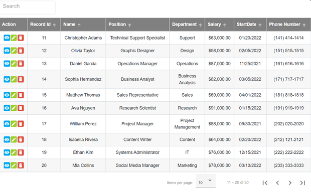

# Dynamic Material Grid

## Overview




Dynamic Material Grid is a versatile Angular library that enhances your table experience. It offers:

- **Server-side pagination, sorting, and searching**
- **Edit, view, and delete buttons**
- **Sticky columns for enhanced visibility**
- **Masking options for phone numbers, currency, and dates**
- **Customizable column headers**
- **Responsive design to fit any screen size**

See  the [live demo here](https://dynamic-material-grid-y571u7-knnmhn.stackblitz.io).

The source code can be found on StackBlitz [here](https://stackblitz.com/edit/dynamic-material-grid-y571u7-bjwfes?file=src%2Fapp%2Fapp.module.ts)

This project was generated with [Angular CLI](https://github.com/angular/angular-cli) version 14.0.0.

## Installation

### Step-1 : install the package

```bash 
npm i dynamic-material-grid --save
```

### Step-2 : Import `DynamicMaterialGridModule` in your module

```typescript

import { DynamicMaterialGridModule } from 'dynamic-material-grid';

@NgModule({
declarations: [
AppComponent
],
imports: [
DynamicMaterialGridModule
]
})
export class YourAppModuleClass {}
```
### Step-3 : Include a theme:
To use an Angular Material prebuilt theme, add the following line to your project's styles file (e.g., `styles.scss` or `styles.css`):
```css
@import "~@angular/material/prebuilt-themes/deeppurple-amber.css";
```
 
### Step-4 : include the link on  your index.html file

```html
<link
  href="https://fonts.googleapis.com/icon?family=Material+Icons"
  rel="stylesheet"
/>
```

### Step-5 : Add BrowserAnimationsModule

Ensure that the BrowserAnimationsModule is imported in your project. If not, add it to your module as well.

```typescript
import {BrowserAnimationsModule} from '@angular/platform-browser/animations';
@NgModule({
    imports: [BrowserAnimationsModule]
    })
export class YourAppModuleClass {}
```

## Usage

Define options in your consuming component:

```typescript
import { MatTableDataSource } from '@angular/material/table';

 public dataSource: any = new MatTableDataSource();

 columns: Column[] = [
{ id: `action`, label: 'Action', columnWidths: 90, sticky: true, centerAligned: true },
{ id: 'column1', label: 'Column Name 1', sticky: true, centerAligned: true },
{ id: 'column2', label: 'Column Name 2', centerAligned: true },
{ id: 'column3', label: 'Column Name 3', columnWidths: 100, centerAligned: true, phoneField : true },
{ id: 'column4', label: 'Column Name 4', width: 100, centerAligned: true , dateField : true },
{ id: 'column5', label: 'Column Name 5', centerAligned: true , currencyField : true },
];
```

The **sticky** property in a column configuration is used to make a specific column "sticky" or fixed while scrolling horizontally in a table. When **`sticky`** is set to **`true`** for a column, it means that the column will remain visible even when the user scrolls horizontally through the table.

**ColumnWidths** is optional parameters and can be used if you want to specify width for each columns.

Similarly you can get **masking** for individual column by using **``phoneField : true``** ,**``dateField : true``** , **``currencyField : true``**
 
The **`centerAligned`** parameter is optional and can be used to make text aligned at the center for specified columns.

When **`centerAligned`** is set to `true`, the text in the specified columns will be centered.

In template use **`<lib-dynamic-material-grid>`** component with your options
```html
<!-- add on your Html page -->
 <lib-dynamic-material-grid 
[headerBackgroundColor]="'#042e6f'"
[dataSource]="dataSource" 
[columnsdef]="columns" 
[totalRecords]="totalRecordsCount" 
[isViewButton]="true" 
[isEditButton]="true" 
[isDeleteButton]="true" 
[currentPage]="yourCurrentPage" 
[pageSize]="yourPageSize" 
[columnSearch]="yourColumnSearch" 
(viewButtonClicked)="yourViewFunction($event)" 
(editButtonClicked)="yourEditFunction($event)" 
(deleteButtonClicked)="yourDeleteFunction($event)" 
(searchFieldChanged)="yourFilterFunction($event)" 
(pageButtonClicked)="yourPageNumberFunction($event)" 
(currentPageButtonClicked)="yourCurrentPageFunction($event)" 
(sortOrderChanged)="yourSortOrderFunction($event)" 
(sortElementChanged)="yourSortElementFunction($event)" 
(paginationChanged)="yourPaginationFunction($event)" 
(closeButtonClicked)="yourClearFunction()"> </lib-dynamic-material-grid>
```

```markdown
<!-- For Header Background Color -->
You can set the header background color using either the color name or the hexadecimal color code. Examples:

- Using color name: `[headerBackgroundColor]= "'[color name]'";`
- Using hexadecimal color code: `[headerBackgroundColor]=  "'[hexadecimal code]'";`

Choose the method that suits your design preferences.
```

## Features

Enjoy a range of **features** with Dynamic Material Grid, inspired by Angular Material Table:

- **Server-side Pagination**: Efficiently manage large datasets with server-side pagination.
- **Sorting and Searching**: Easily sort and search your data for quick access.
- **Edit, View, Delete**: Add, view, or delete rows with dedicated buttons for each operation.
- **Sticky Columns**: Keep essential columns in view while scrolling horizontally.
- **Masking Options**: Apply masks for phone numbers, currency, and dates.

Explore the full range of **features** to elevate your table components with Dynamic Material Grid!


